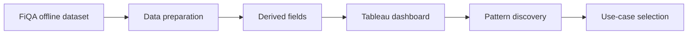
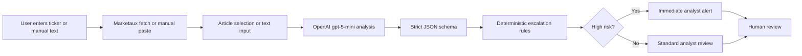
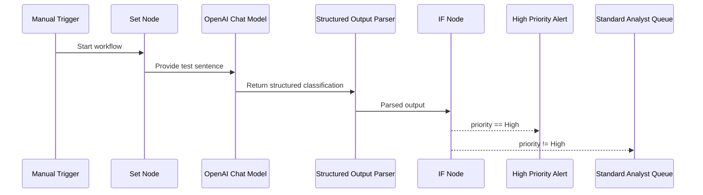

# Capstone Technical Documentation

**Project:**  FinRadar AI — Round 1 Project Notes
**Author:** Parisa Dehghani  
**Snapshot date:** 2026-09-01

> **Historical Round 1 artifact:** This document preserves the original
> discovery and proof-of-concept stage of the FinRadar AI project.
>
> The current Round 2 submission is documented in:
> - `README.md`
> - `use_case_definition.md`
> - `mvp/mvp_documentation.md`
> - `evaluation/evaluation_summary_round2.md`
> - `roi_risk_assessment.md`
> - `strategic_plan.md`
> - `compliance/`

## 1. Purpose

This repository documents and prototypes an AI-assisted financial news triage system for investment research teams.

The core idea is to reduce the manual effort required to:

- review financial headlines and short news items
- classify the news by business area and topic
- detect sentiment
- assign priority and risk level
- surface urgent items for analyst review

The project is explicitly human-in-the-loop:

- it does not execute trades
- it does not provide investment advice
- it does not make autonomous investment decisions

## 2. State at the End of Round 1

The project is currently in Round 1 and includes:

- offline dataset analysis using FiQA
- a Tableau Public dashboard
- an n8n proof of concept for structured AI triage
- a Gradio live MVP that can fetch Marketaux news and analyze it with OpenAI
- LangSmith monitoring documentation and a sample trace
- evaluation artifacts for prompt and classification quality
- research notes on use case, data source selection, API options, and cost/timeline

What is implemented now:

- offline analysis and dashboarding are complete
- structured AI triage logic is implemented
- live public-news fetching is implemented through Marketaux in the Gradio app
- deterministic escalation rules are implemented in the live app
- prompt iteration was evaluated and a weaker variant was rejected

What is not yet production-ready:

- no authenticated analyst system
- no persistent analyst queue database
- no production deployment/security layer
- no automated feedback loop
- no live end-to-end production workflow

## 3. Repository Map

### Top-level structure

- `README.md` - project overview and round-1 summary
- `capstone.md` - this technical snapshot
- `requirements.txt` - root Python dependency list
- `data/fiqa_powerbi_ready.csv` - prepared offline dataset for dashboarding
- `dashboard/` - Tableau dashboard files and documentation
- `evaluation/` - benchmark outputs and prompt comparison results
- `feedback/` - round 1 decision notes
- `langsmith/` - monitoring documentation and trace screenshot
- `mvp/` - Gradio applications and screenshots
- `n8n/` - workflow JSON and proof-of-concept documentation
- `research/` - research and source-selection notes
- `cost_estimation/` - rough pilot cost and timeline estimate
- `presentation/` - presentation deck

### Key implementation files

- `mvp/app.py` - current Gradio app with Marketaux live fetch, OpenAI analysis, structured output, and escalation logic
- `mvp/app_marketaux_only.py` - earlier/simpler live-news app variant focused on Marketaux fetching
- `n8n/AI Financial News Triage POC.json` - manual-trigger n8n workflow with OpenAI structured classification and routing

## 4. Data Foundation

### Offline dataset

The main offline dataset is FiQA 2018:

- dataset name: `TheFinAI/fiqa-sentiment-classification`
- total records used in the project: `1,173`
- source fields referenced in the project: `sentence`, `target`, `aspect`, `score`, `type`, `split`

### Derived fields

The project adds derived fields for analysis:

- `Business_Area`
- `Topic`
- `Sentiment_Category`

### Sentiment thresholding

FiQA provides a continuous sentiment score from `-1` to `+1`.

The project defines its own visualization thresholds:

- Positive: score `> +0.2`
- Negative: score `< -0.2`
- Neutral: score between `-0.2` and `+0.2` inclusive

This is a project-specific categorization for dashboarding, not an official FiQA label.

## 5. Dashboard Layer

### Tooling

- BI platform: Tableau Public
- Dashboard asset: `dashboard/AI Financial News Intelligence Dashboard.pdf`
- Tableau workbook: `dashboard/AI Financial News Intelligence - Round 1.twbx`
- SVG export: `dashboard/AI Financial News Intelligence Dashboard.svg`

### Dashboard purpose

The dashboard is used to analyze the offline FiQA dataset before moving to live automation.

It answers questions such as:

- what financial content appears most frequently
- which business areas dominate the dataset
- which topics skew positive or negative
- which targets are mentioned most often

### Main dashboard metrics

- total items: `1,173`
- average sentiment: approximately `0.122`
- positive items: `635`
- negative items: `321`
- neutral items: `217`

### Business area distribution

- Stock: `647`
- Corporate: `479`
- Market: `40`
- Economy: `7`

### Dashboard filters

- business area
- sentiment category

### Dashboard role in the project

The dashboard is the project’s offline analysis layer and supports use-case selection, pattern discovery, and stakeholder communication.

## 6. Automation POC

### Tooling

- automation platform: n8n
- model: OpenAI `gpt-5-mini`

### Purpose

The n8n POC demonstrates how an AI model can convert a financial sentence into structured triage output and route it by priority.

### Workflow in the POC

1. manual trigger starts the workflow
2. a test sentence is injected with a Set node
3. the sentence is passed to an OpenAI chat model
4. a structured output parser enforces the schema
5. an IF node checks whether `priority == High`
6. the item is routed either to `High Priority Alert` or `Standard Analyst Queue`

### Structured output fields

- `target`
- `business_area`
- `topic`
- `sentiment`
- `priority`
- `summary`

### POC routing rule

- `priority == High` -> immediate alert
- otherwise -> standard review queue

### POC test case

The documented high-priority test sentence about Tesla regulatory investigation was routed correctly to the alert path.

### POC limitation

This is not a production workflow:

- trigger is manual
- input is synthetic/test-driven
- there is no live ingest pipeline in the n8n flow
- there is no analyst database or enterprise access control

## 7. Live MVP Application

### Tooling

- framework: Gradio
- live news source: Marketaux
- AI provider: OpenAI

### App file

- `mvp/app.py`

### Environment variables

The app loads from `.env` at the repository root and expects:

- `MARKETAUX_API_KEY`
- `OPENAI_API_KEY`

### Current UI structure

The Gradio app exposes two tabs:

- `Live News`
- `Manual Public News`

### Live News tab behavior

1. user enters a ticker symbol
2. app calls Marketaux for up to 3 latest public financial news items
3. article titles are shown in a radio list
4. the selected article can be displayed
5. the selected article can be sent to OpenAI for analysis

### Manual Public News tab behavior

1. user pastes a public financial headline or short summary
2. the text is passed directly to OpenAI
3. the model returns structured triage output

### Live fetch behavior

The live fetch function:

- trims and uppercases the ticker
- validates that a symbol was entered
- validates that the Marketaux API key exists
- requests English news with `limit=3`
- handles request and JSON parsing failures
- returns article choices plus the selected article content

### OpenAI analysis behavior

The app uses:

- model: `gpt-5-mini`
- system prompt: financial-news triage instructions
- response format: strict JSON schema

### Live app schema

The model must return:

- `target`
- `business_area`
- `topic`
- `sentiment`
- `priority`
- `risk_type`
- `summary`

### Deterministic escalation logic

The live app does not rely only on the model’s priority label. It also applies deterministic escalation rules:

- `priority == High` -> escalate
- `risk_type == Fraud` -> escalate
- `risk_type in {Regulatory, Legal, Compliance}` and `sentiment == Negative` -> escalate

This creates a second safety layer for material risk-sensitive items.

### Output format

The analysis is rendered as:

- a high-priority alert or standard review banner
- a table containing the structured fields
- a concise summary
- a final note that human review is required

## 8. Monitoring

### Tooling

- monitoring platform: LangSmith

### Purpose

LangSmith is used for trace-level observability of the AI component.

### What is visible in traces

- user input
- system prompt
- model output
- model used
- latency
- token usage
- estimated cost
- trace status

### Sample trace values documented

- latency: approximately `5.43` seconds
- tokens: `534`
- estimated cost: approximately `$0.0008`

### Why monitoring matters

Monitoring supports:

- transparency
- debugging
- latency tracking
- cost tracking
- prompt governance

## 9. Evaluation State

### Evaluation setup

A balanced sample of 30 FiQA test records was used:

- 10 positive
- 10 neutral
- 10 negative

### v1 metrics

- Business Area Accuracy: `93.3%`
- Strict Target Accuracy: `66.7%`
- Sentiment Accuracy: `66.7%`
- Execution Errors: `0 / 30`

### Prompt iteration result

A second prompt version was tested.

Result:

- Sentiment Accuracy decreased from `66.7%` to `56.7%`

Decision:

- the change was rejected

### Evaluation takeaway

Prompt changes must be benchmarked before adoption. A prompt that sounds better can still reduce classification quality.

## 10. Cost And Timeline

### Pilot assumptions

- small analyst team
- monthly volume around `5,000` financial items
- human review required
- offline first, then live API
- no autonomous investment decisions

### Rough AI cost estimate

Based on the documented trace:

- approximate AI cost per example: `$0.0008`
- approximate monthly AI cost for 5,000 items: about `$4`

This excludes implementation and infrastructure costs.

### Estimated timeline

- data review and dashboard: 3-5 days
- AI workflow and structured output: 3-5 days
- evaluation and monitoring: 2-4 days
- live API integration: 3-5 days
- security, testing, and governance: 3-5 days
- analyst pilot and feedback: 1-2 weeks

Total rough pilot duration:

- approximately 4-6 weeks

## 11. Current Functional Flow

### Offline analysis flow

### Live triage flow

### n8n POC flow

## 12. Technical Implementation Notes

### `mvp/app.py`

This is the main live application and contains:

- configuration loading from `.env`
- Marketaux API integration
- OpenAI chat-completion call
- strict JSON schema definition
- helper functions for article selection and display
- escalation logic
- Gradio UI with two tabs

### `mvp/app_marketaux_only.py`

This file is an earlier/simpler Marketaux-only variant:

- fetches public news for a ticker
- shows article titles
- displays article details
- does not include the OpenAI analysis layer found in `mvp/app.py`

### `n8n/AI Financial News Triage POC.json`

This file defines the proof-of-concept automation graph:

- Manual Trigger
- Set node with a Tesla test sentence
- OpenAI Chat Model node
- Structured Output Parser
- IF branch on priority
- High Priority Alert path
- Standard Analyst Queue path

## 13. Known Limitations

- live news source currently depends on a third-party API
- the live MVP is still a demo application rather than a production service
- there is no analyst identity, permissions, or audit layer
- there is no queue persistence for analyst action tracking
- there is no feedback loop to retrain or refine the system automatically
- the evaluation sample is small
- target extraction and sentiment classification are not perfect
- the project remains assistance-oriented, not decision-autonomous

## 14. Practical Run Requirements

To run the live MVP, the environment needs:

- Python dependencies from `requirements.txt` and `mvp/requirements.txt`
- a valid Marketaux API key
- a valid OpenAI API key
- network access to the Marketaux API and OpenAI API

## 15. Summary

This project is currently a well-scoped Round 1 AI financial-news triage prototype with:

- offline evidence from FiQA
- BI exploration in Tableau
- a structured n8n classification proof of concept
- a Gradio live analysis app
- monitoring via LangSmith
- benchmarked evaluation results

The current design intentionally keeps the human analyst in the decision loop.
